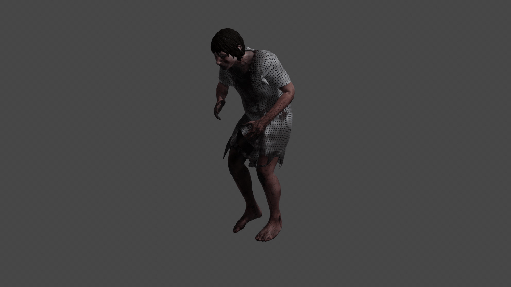

# IA para el videojuego Cynthia
## Proyecto final de la asignatura Inteligencia Artificial para Videojuegos

### Desarrollado por Jorge Moreno Martíenz

 

# __Índice__
- [Introducción](#Introducción)
- [Motivación del proyecto](#Motivación-del-proyecto)
- [Mecánicas de la demo](#Mecánicas-de-la-demo)

---

 

# __Introducción__

Este proyecto es una demo técnica desarrollada en Unity con el objetivo de servir como campo de pruebas para tener una Inteligencia Artificial funcional y divertida en otro proyecto: la segunda parte del videojuego [*Cynthia*](https://kryystinn.itch.io/cynthia).
 

La demo consta de un nivel concreto del juego, un hospital, en donde el jugador es víctima de una persecución a manos del enemigo principal del juego. Este enemigo es una mujer, de nombre __Cynthia__, la madre de un bebé que también está en el hospital.
 
 

 
 

Dentro del juego, el objetivo es obtener un objeto coleccionable y después salir por el mismo lugar por el que has entrado. En realidad, en *Cynthia* este objeto es una parte de la historia, que no está incluida para ahorrar la implementación.
 

Cynthia irá merodeando por el mapa del hospital, buscándote continuamente. No obstante, si escucha al bebé lo priorizará incluso antes de ir a por ti. Esto genera una dinámica de provocar a Cynthia y distraerla de su patrulla para poder obtener el objeto coleccionable. Si Cynthia se acerca demasiado a ti, pierdes la partida.

---

 

# __Motivación del proyecto__

[*Cynthia*](https://kryystinn.itch.io/cynthia) es un videojuego creado para una Game Jam, el TechFest 2021. El juego fue ganador del concurso, pero no se quedó ahí: triunfó bastante entre fans del género de horror en Japón, por lo que los desarrolladores decidieron hacer una segunda parte.

Yo estoy participando en esta segunda entrega, en la que nos hemos encontrado con la necesidad de hacer una Inteligencia Artificial para la zona del hospital. El desarrollo está siendo en Unreal Engine 4.

Así pues, dado que durante todo el cuatrimestre hemos estado trabajando con Unity y que UE4 te da muchas cosas hechas, he decidido hacer la demo en Unity para demostrar lo aprendido en la asignatura. Más tarde, exportaré los comportamientos al proyecto de Unreal.

---

 

# __Mecánicas de la demo__

Dentro de la demo, el jugador puede hacer las siguientes acciones:

- Agacharse, caminar, correr y saltar (todos estos movimientos producen ruido, cada uno más que el anterior).
- Coger al bebé en brazos y soltarlo.
- Calmar al bebé cuando está llorando.
- Coger el objeto coleccionable que sirve para acabar la partida.
- Escapar del hospital por el mismo sitio por el que ha entrado.

Además, Cynthia puede:

- Andar por todo el escenario (incluyendo escaleras).
- Coger al bebé y soltarlo en una cuna.
- Calmar al bebé cuando está llorando.
- Perseguir al jugador.
- Asesinar al jugador.

Y por último, el bebé puede:

- Llorar.

(Como aclaración, esto es lo único que hacen los bebés humanos en general, por lo que se podría decir que el comportamiento del bebé es muy realista y podría merecer una matrícula de honor).

---

